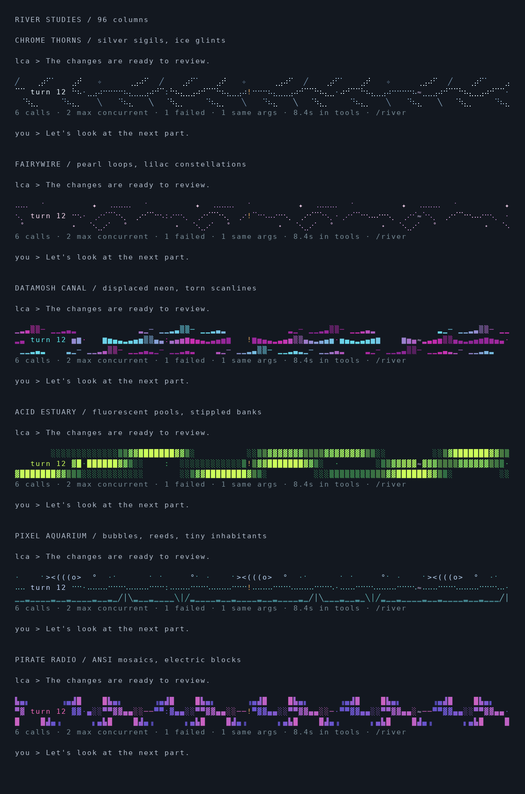

# Expressive river collection



```sh
lua5.5 scripts/river-gallery.lua 96 --color --expressive
lua5.5 scripts/river-gallery.lua 40 --color --expressive
python3 scripts/river-preview.py --expressive
```

The screenshot records the original six-design collection. `datamosh` has since
been removed from the runtime and gallery generator. The remaining designs are:

- `chrome`: silver branching strokes and icy highlights.
- `fairywire`: pearl loops, lilac stars, and small hanging ornaments.
- `acid`: fluorescent filled channels with stippled edges and dark pools.
- `pirate`: stepped ANSI mosaics in violet, blue, and pink.

The gallery gives every design the same synthetic six-call trace: one failure,
one repeated call, and peak concurrency of two. The existing amber failure,
lavender repeat, and overlap marks override decorative cells. Captions stay
consistent. No decorative color or creature implies a task outcome.

All designs remain three terminal rows plus the factual caption. Narrow terminals
and explicit ASCII mode retain the plain fallback. The artwork is generated from
local formulas and character patterns with no model calls, downloads, or animation.

The PNG is rendered from the real ANSI output; actual terminal font shapes and
spacing vary. Use the Lua command to inspect the native output.

Visual research references: [Glowdrift](https://github.com/dnvsfn/glowdrift),
[Glyph](https://github.com/Codeptor/glyph), [Durdraw](https://durdraw.org/),
[Sixteen Colors](https://16colo.rs/),
[InspireMari dividers](https://inspiremari.nl/resources/free-text-dividers-ascii/),
and [an artist's cybersigilism discussion](https://www.reddit.com/r/Sketch/comments/10guvxu/some_cyber_sigilism_i_draw_late_at_night/).
The river compositions are original; no source artwork was imported.
