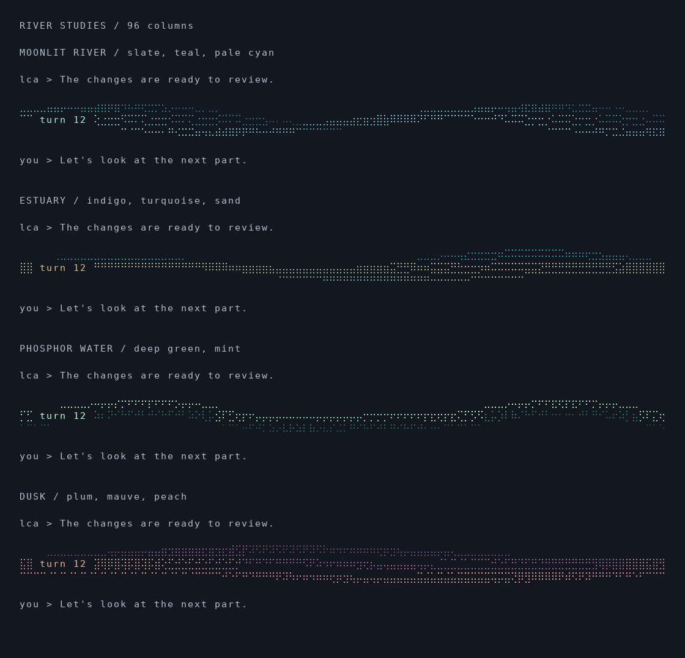
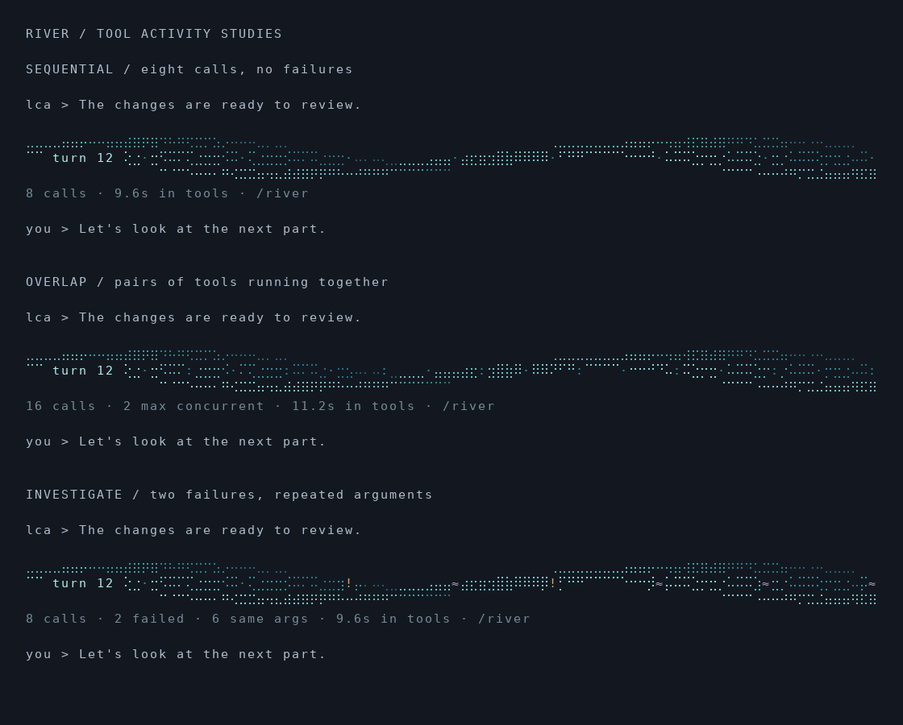

# River studies

The library now also includes [six expressive designs](river-expressive.md), with
a separate color gallery. The [eight river worlds](river-worlds.md) extend the collection to eighteen
designs in the random turn selection.

The original four static, deterministic designs: moonlit river, estuary, phosphor water, and dusk. Each uses a different current geometry and three-stop truecolor palette. The former ASCII motif prototype has been replaced.



Run the actual terminal gallery from the repository root:

```sh
lua5.5 scripts/river-gallery.lua 96 --color
lua5.5 scripts/river-gallery.lua 40 --color
lua5.5 scripts/river-gallery.lua 72 --ascii
```

Without a width, the gallery shows 40, 72, and 100 columns. Without `--color`, it prints monochrome. `river-gallery.ansi` contains the 96-column color output; `river-gallery.txt` contains the monochrome width gallery.

The PNG is a rendering of the actual ANSI output, with Braille dots drawn explicitly. Terminal fonts can give the dots a different weight or spacing. Regenerate with `python3 scripts/river-preview.py` (requires Pillow).

`lua/agent/river_divider.lua` exposes `names()` and `render({width, seed, turn, status, color, design, ascii})`, returning lines and the selected design name. A stable seed and turn choose a design and curve phase. A `design` override selects `moonlit`, `estuary`, `phosphor`, or `dusk`. No clock, global RNG, external artwork, or model calls are involved.

The strip uses three rows of Unicode Braille, with a quiet opening for the turn label. Below 32 columns, or with `ascii=true`, it uses a single plain divider. Status accepts an observed `interrupted` or `failed` event; no status implies no success claim. Color is opt-in and does not change geometry.

The conversation UI now commits a river after each agent turn, including cancellation and errors. It uses a separate per-turn event trace, so older calls remain available after leaving the live tool window. `/river` displays the most recent turn's numbered calls, arguments, result excerpts, durations, and repeat references.

## Tool activity



```sh
lua5.5 scripts/river-gallery.lua 96 --color --activity
python3 scripts/river-preview.py --activity
```

Markers are consistent across palettes: `·` is a call, `:` starts while another call is active, `≈` repeats the exact tool name and arguments, amber `!` is an observed error, and `?` is a call without a completion when the turn ended. Repeats are observations, not claims of redundant work. Deferred calls are counted separately in the caption. No automatic recovery or quality score is inferred.

Positions follow call-start order, not elapsed time. If multiple events share a terminal column, failure markers take precedence, then unfinished calls, repeats, overlap, and ordinary calls. The caption retains exact totals even when the strip cannot show every event separately. Very narrow terminals use the plain divider and wrapped caption.

Tool time is the union of intervals with at least one active call: parallel work is not double-counted, and model-only gaps are excluded. It measures foreground tool callbacks, not unobserved background-job lifetime or provider-side tools. `/river` retains the latest turn only; raw run logs remain under `/tmp/lca/logs`.

The activity gallery uses synthetic event sequences and the same collector and renderer as the live UI.

Visual references (original implementations here, no source or artwork copied):

- [Halo](https://github.com/programmersd21/halo): fine Braille flow trails.
- [Glowdrift](https://github.com/dnvsfn/glowdrift): oceanic color and branching flow.
- [Terminal Oscilloscope](https://github.com/rolandnsharp/terminal-oscilloscope): bright traces with fading echoes.
- [TerminalTextEffects](https://github.com/ChrisBuilds/terminaltexteffects): coordinated gradients.

### Reading `/river`

Each call has a numbered heading, status, duration, named arguments, and a labeled result. Commands and multiline values appear on indented lines; wrapping stays within the terminal width. Arguments are captured at tool start, separately from the internal repeat-comparison key. The internal type tags and byte-length prefixes are never displayed.

The interactive UI randomly chooses one of the 18 designs when a turn starts
and retains that choice through completion and redraws. Each design is equally
eligible on every turn, so repeats can occur. Gallery overrides and the standalone
renderer remain deterministic for reproducible previews.
