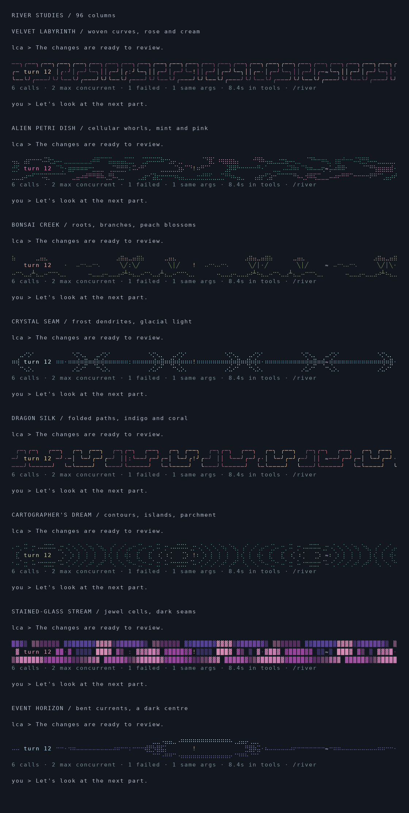

# Eight river worlds



```sh
lua5.5 scripts/river-gallery.lua 96 --color --worlds
lua5.5 scripts/river-gallery.lua 40 --color --worlds
python3 scripts/river-preview.py --worlds
```

The eight new designs join the ten existing designs in the random turn selection:

- `velvet`: interlocking woven paths in rose, aubergine, and cream.
- `petri`: cellular ridges in petrol blue, mint, and pink.
- `bonsai`: small trees with branching roots and warm foliage.
- `crystal`: glacial dendrites along a thin central seam.
- `dragon`: folded angular paths with an indigo-to-coral-to-gold gradient.
- `cartographer`: nested contour rings and basins in teal and parchment.
- `glass`: deterministic Voronoi cells with dark seams and jewel colors.
- `horizon`: luminous elliptical rings and currents around a dark centre.

These are compact visual interpretations, not full physical simulations or
mathematical fractal renderers. All geometry is generated locally. The same
synthetic six-call trace appears in each gallery strip, with one failure and one
repeat; signal markers override decoration and retain their established meaning.

The PNG is rendered from actual ANSI output. Terminal fonts may draw character
shapes differently. Each design uses three rows plus the factual caption; narrow
terminals keep the plain fallback.

References: [cbonsai](https://github.com/jakobrees/cbonsai),
[Glyphwork](https://github.com/muraleph/glyphwork),
[Termflix](https://github.com/paulrobello/termflix),
[Truchet artwork](https://gist.github.com/nst/b6dbead217ea2f43c45c91271c628eac),
[Tessera](https://github.com/Matz999/Tessera), and
[ASCII terrain rendering](https://the-wind-through-the-wheels.com/blog/design-and-rendering-of-roads-and-landscapes-in-ascii-art-from-topographic-data/).
